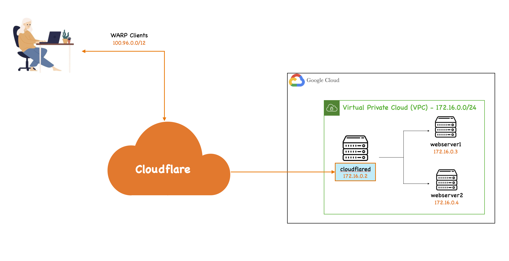

# Welcome to your GCP Infrastrcuture Python project!

This project helps you to deploy the following environment on GPC (for your Cloudflare Tunnel quick demos).


## 1. Login to your Google account
```
$ gcloud auth login
```

## 2. Check which account is currently active
```
$ gcloud auth list
```

## 3. Switch to a Different Account
```
$ gcloud config set account ACCOUNT_EMAIL
```

## 4. Set a Default Project for the Account
```
$ gcloud config set project PROJECT_ID
```

## 5. Install the Google Cloud SDK (if not already installed)
```
$ curl https://sdk.cloud.google.com | bash
$ gcloud init
```

## 6. Create a service account
```
$ gcloud iam service-accounts create infrastructure-manager
```

## 7. Grant necessary permissions
```
$ gcloud projects add-iam-policy-binding YOUR_PROJECT_ID \
    --member="serviceAccount:infrastructure-manager@YOUR_PROJECT_ID.iam.gserviceaccount.com" \
    --role="roles/compute.admin"
```

## 8. Create and download credentials file
```
$ gcloud iam service-accounts keys create credentials.json \
    --iam-account=infrastructure-manager@YOUR_PROJECT_ID.iam.gserviceaccount.com
```

## 9. Set up your configuration file
Create a copy of the configuration file

```
$ cp gcp_config_template.yaml gcp_config.yaml
```

Please update the configurations on the `gcp_config.yaml` file depending on you current account (modify the `line 3 & 4` sections)


## 10. Finally Create/Destroy the env
```
$ python gcp_infrastructure.py
$ python gcp_infrastructure.py destroy
```

## 11. Create your Cloudflare Tunnel from the "tunnel" instance
